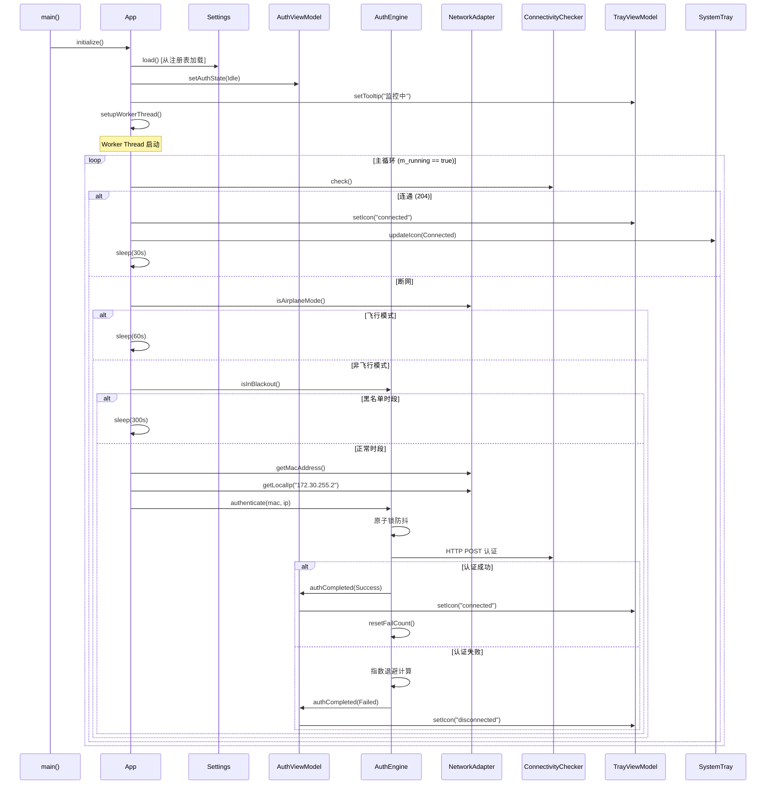
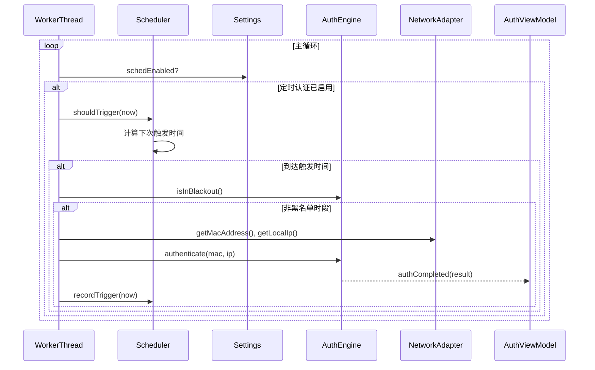
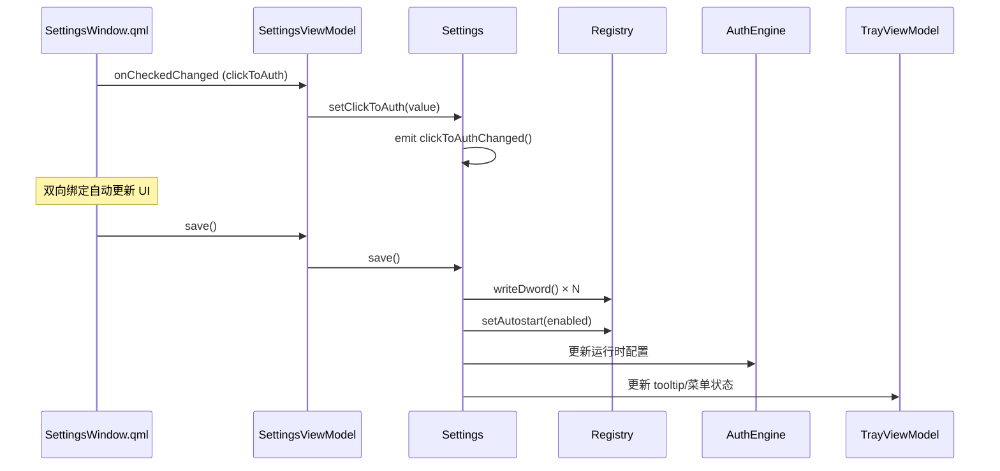
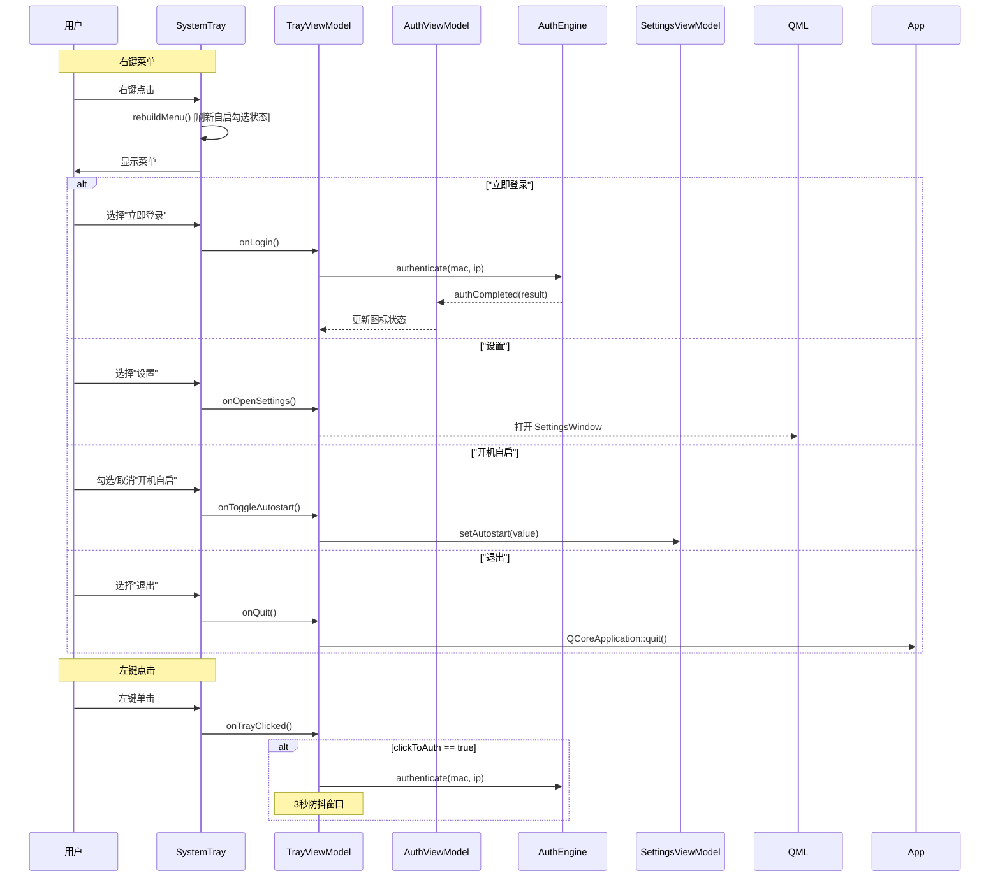
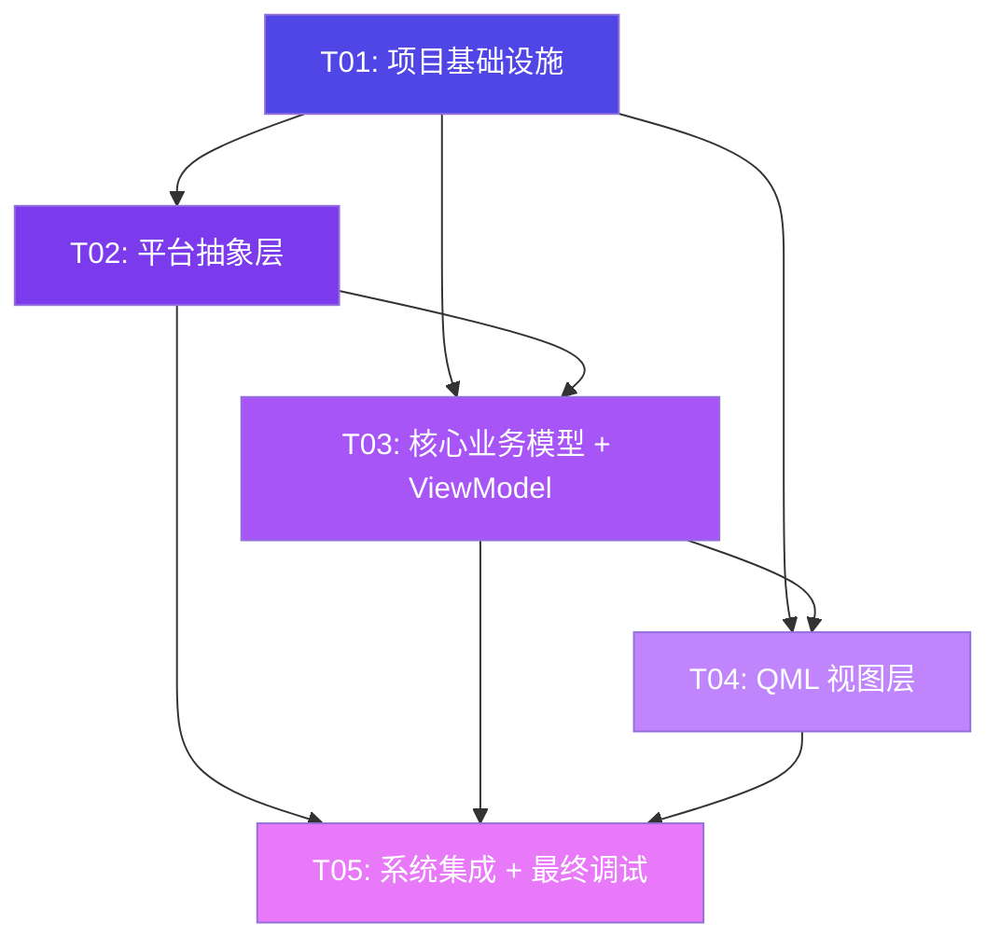

# AutoLogin 校园网自动登录 — 系统架构设计文档

## 1. 实现方案 + 框架选型

### 1.1 整体架构方案

采用 **MVVM（Model-View-ViewModel）** 架构，将原 C + Qt Widgets 混合代码重构为纯 C++17 + Qt6 QML 体系。核心原则：

| 层次 | 职责 | 技术 |
|------|------|------|
| **Platform** | Win32/WinRT API 隔离，消除 `#include <windows.h>` 泄漏 | C++17 封装类，延迟加载 COM |
| **Model** | 核心业务逻辑（认证、检测、调度、日志、设置） | 纯 C++17，无 Qt 依赖（Logger 除外） |
| **ViewModel** | 通过 `Q_PROPERTY` 将 Model 数据暴露给 QML | QObject 子类，信号/槽桥接 |
| **View** | 声明式 UI，零业务逻辑 | QML + Qt Quick |

**架构约束映射**：
- **消除全局变量**：原 `g_auth_busy`、`g_sched_enabled` 等 13 个 `volatile LONG` 全部封装为类成员，使用 `std::atomic` 替代
- **Win32 隔离**：`GetAdaptersAddresses`、`RegOpenKeyExA`、`Shell_NotifyIconW` 全部封装到 `Platform::` 命名空间
- **WinRT COM 隔离**：热点管理独立 `HotspotManager` 类，`LoadLibraryW(L"combase.dll")` 延迟加载
- **C++17 特性**：`std::optional`（注册表读取返回值）、`std::variant`（认证结果类型）、结构化绑定、`if constexpr`

**关键架构决策**：
1. **QSystemTrayIcon + QML 桥接**：Qt6 无原生 QML SystemTray，使用 `QSystemTrayIcon`（C++ 端）+ `TrayViewModel`（QML 端），通过信号/槽通信
2. **工作线程模型**：保留原 C 的 worker thread 模式，使用 `QThread` + `std::atomic<bool>` 控制生命周期，通过 `QMetaObject::invokeMethod` 跨线程更新 ViewModel
3. **毛玻璃降级策略**：优先 Mica → Acrylic → 半透明纯色（`SetWindowAttribute` + `DwmExtendFrameIntoClientArea`），运行时检测 Windows 版本
4. **HTTP 客户端**：使用 Qt6 `QNetworkAccessManager` 替代 WinHTTP，简化跨平台代码（尽管当前仅 Windows），避免手动管理 `HINTERNET` 句柄

### 1.2 框架/库选型

| 组件 | 选型 | 理由 |
|------|------|------|
| **UI 框架** | Qt6 Quick (QML) | PRD 约束：声明式 UI，禁止 Widgets |
| **构建系统** | CMake 3.20+ | Qt6 官方推荐，Ninja 生成器 |
| **网络** | Qt6 Network (QNetworkAccessManager) | 替代 WinHTTP，RAII 自动管理，异步非阻塞 |
| **注册表** | QSettings (NativeFormat) | Qt 原生封装，自动处理 `REG_DWORD`/`REG_SZ` |
| **托盘** | QSystemTrayIcon | Qt6 唯一可靠方案，QML 无原生替代 |
| **日志** | 自实现 QFile + QTextStream | 原版逻辑复用（7天自动清理 + 手动清理） |
| **WinRT COM** | 手动 vtable（延迟加载 combase.dll） | 原版已验证可行，无需引入 C++/WinRT 依赖 |
| **毛玻璃** | DWM API (dwmapi.dll) | Win10 1803+ Acrylic，Win11 Mica，运行时检测 |
| **JSON** | Qt6 Core (QJsonDocument) | 设置导入/导出，未来云端配置 |

---

## 2. 文件列表及相对路径

```
.
├── CMakeLists.txt                      # 构建配置，Qt6 + Win32 库链接
├── app.manifest                        # UAC 清单（DPI aware + UTF-8）
├── src/
│   ├── main.cpp                        # 入口：初始化 App → 注册 VM → 加载 QML
│   ├── App.h                           # 应用编排器：创建 Model/VM/Tray
│   ├── App.cpp                         # App 实现：组装 MVVM 管线
│   ├── platform/
│   │   ├── Win32Defs.h                 # Win32/WinRT COM 类型前向声明（仅本目录使用）
│   │   ├── NetworkAdapter.h            # 网卡检测：飞行模式/WLAN/MAC/IP
│   │   ├── NetworkAdapter.cpp
│   │   ├── Registry.h                  # 注册表读写封装（QSettings 上层）
│   │   ├── Registry.cpp
│   │   ├── HotspotManager.h            # WinRT 热点管理（延迟加载 combase.dll）
│   │   ├── HotspotManager.cpp
│   │   ├── Notification.h              # Shell_NotifyIcon 气泡通知
│   │   ├── Notification.cpp
│   │   ├── SystemTray.h                # QSystemTrayIcon + QMenu 封装
│   │   └── SystemTray.cpp
│   ├── model/
│   │   ├── AuthEngine.h                # 认证引擎：防抖 + 黑名单 + 退避 + 二次校验
│   │   ├── AuthEngine.cpp
│   │   ├── ConnectivityChecker.h       # 互联网连通性检测（HTTP 204）
│   │   ├── ConnectivityChecker.cpp
│   │   ├── Scheduler.h                # 定时认证调度器（间隔 + 偏移）
│   │   ├── Scheduler.cpp
│   │   ├── Logger.h                    # 线程安全文件日志 + 7天自动清理
│   │   ├── Logger.cpp
│   │   ├── Settings.h                  # 设置模型（Q_PROPERTY + 注册表持久化）
│   │   └── Settings.cpp
│   ├── viewmodel/
│   │   ├── AuthViewModel.h             # 认证状态暴露给 QML
│   │   ├── AuthViewModel.cpp
│   │   ├── SettingsViewModel.h         # 设置项暴露给 QML（双向绑定）
│   │   ├── SettingsViewModel.cpp
│   │   ├── TrayViewModel.h             # 托盘图标/菜单状态暴露给 QML
│   │   ├── TrayViewModel.cpp
│   │   ├── ThemeViewModel.h            # 明暗主题 + 色板暴露给 QML
│   │   └── ThemeViewModel.cpp
│   └── view/
│       ├── Main.qml                    # 根 QML：StackView 管理 SettingsWindow
│       ├── SettingsWindow.qml           # 设置窗口：4 张卡片布局 + 毛玻璃背景
│       ├── Cards/
│       │   ├── BasicSettingsCard.qml   # 基本设置卡片（点击认证/自启/通知）
│       │   ├── NetworkSettingsCard.qml # 网络设置卡片（热点/优先级）
│       │   ├── ScheduleCard.qml        # 定时认证卡片（开关/间隔/偏移）
│       │   └── AccountCard.qml         # 账户信息卡片（用户名/密码）
│       └── Components/
│           ├── SwitchToggle.qml        # 自定义开关（弹性动画）
│           ├── ThemeToggle.qml         # 太阳/月亮切换按钮（300ms 过渡）
│           └── CardSpinBox.qml          # 卡片内 SpinBox（居中数字 + 单位标签）
├── resources/
│   ├── resources.qrc                   # Qt 资源文件
│   └── icons/
│       ├── connected.svg               # 联网状态图标（绿色）
│       ├── disconnected.svg            # 断网状态图标（红色）
│       └── authenticating.svg           # 认证中图标（黄色脉冲）
```

---

## 3. 数据结构和接口（类图）

```mermaid
classDiagram
    direction TB

    class App {
        -AuthEngine* m_authEngine
        -ConnectivityChecker* m_connectivity
        -Scheduler* m_scheduler
        -Logger* m_logger
        -Settings* m_settings
        -AuthViewModel* m_authVM
        -SettingsViewModel* m_settingsVM
        -TrayViewModel* m_trayVM
        -ThemeViewModel* m_themeVM
        -Platform::SystemTray* m_tray
        -Platform::HotspotManager* m_hotspot
        -QThread* m_workerThread
        +initialize() bool
        +run() int
        -setupWorkerThread()
        -setupTrayConnections()
        -setupViewModelBindings()
    }

    class Settings {
        <<QObject>>
        +Q_PROPERTY: bool clickToAuth
        +Q_PROPERTY: bool autostart
        +Q_PROPERTY: bool notifications
        +Q_PROPERTY: bool autoHotspot
        +Q_PROPERTY: bool highPriority
        +Q_PROPERTY: bool schedEnabled
        +Q_PROPERTY: int schedInterval
        +Q_PROPERTY: int schedOffset
        +Q_PROPERTY: QString username
        +Q_PROPERTY: QString password
        +load()
        +save()
        +signals: settingsChanged()
    }

    class AuthEngine {
        <<QObject>>
        -atomic~bool~ m_busy
        -atomic~qint64~ m_lastAuthMs
        -int m_failCount
        -ConnectivityChecker* m_checker
        -Logger* m_logger
        -Settings* m_settings
        +authenticate(mac: string, ip: string) AuthResult
        +isBusy() bool
        +isInBlackout() bool
        +resetFailCount()
        +getExponentialBackoff(fails: int) int
        +signals: authCompleted(result)
        +signals: statusMessage(msg)
    }

    class ConnectivityChecker {
        +check() bool
        -QNetworkAccessManager* m_nam
    }

    class Scheduler {
        <<QObject>>
        -qint64 m_lastSchedAuth
        -Settings* m_settings
        +shouldTrigger(now: qint64) bool
        +recordTrigger(ts: qint64)
        +nextTriggerTime() qint64
        +signals: triggerAuth()
    }

    class Logger {
        <<QObject>>
        -QFile m_logFile
        -QString m_logPath
        -QMutex m_mutex
        +log(msg: QString)
        +autoCleanup()
        +manualCleanup() bool
        +logPath() QString
        +signals: logMessage(msg)
    }

    class AuthViewModel {
        <<QObject>>
        +Q_PROPERTY: AuthState authState
        +Q_PROPERTY: QString statusText
        +Q_PROPERTY: bool isAuthenticating
        +Q_INVOKABLE triggerLogin()
        +Q_INVOKABLE checkConnectivity()
        +signals: authStateChanged()
    }

    class SettingsViewModel {
        <<QObject>>
        +Q_PROPERTY: bool clickToAuth
        +Q_PROPERTY: bool autostart
        +Q_PROPERTY: bool notifications
        +Q_PROPERTY: bool autoHotspot
        +Q_PROPERTY: bool highPriority
        +Q_PROPERTY: bool schedEnabled
        +Q_PROPERTY: int schedInterval
        +Q_PROPERTY: int schedOffset
        +Q_PROPERTY: QString username
        +Q_PROPERTY: QString password
        +Q_INVOKABLE save()
        +Q_INVOKABLE load()
        +Q_INVOKABLE resetDefaults()
    }

    class TrayViewModel {
        <<QObject>>
        +Q_PROPERTY: QString iconSource
        +Q_PROPERTY: QString tooltip
        +Q_PROPERTY: bool autostartChecked
        +Q_INVOKABLE onTrayClicked()
        +Q_INVOKABLE onShowLog()
        +Q_INVOKABLE onLogin()
        +Q_INVOKABLE onCleanLog()
        +Q_INVOKABLE onToggleAutostart()
        +Q_INVOKABLE onOpenSettings()
        +Q_INVOKABLE onQuit()
    }

    class ThemeViewModel {
        <<QObject>>
        +Q_PROPERTY: bool isDark
        +Q_PROPERTY: QVariantMap palette
        +Q_INVOKABLE toggle()
        +signals: isDarkChanged()
        +signals: paletteChanged()
    }

    class NetworkAdapter {
        +isAirplaneMode() bool
        +hasWlanAdapter() bool
        +getMacAddress() string
        +getLocalIp(gateway: string) string
    }

    class Registry {
        +readDword(key: QString, value: QString) optional~DWORD~
        +writeDword(key: QString, value: QString, data: DWORD)
        +readString(key: QString, value: QString) optional~QString~
        +writeString(key: QString, value: QString, data: QString)
        +deleteValue(key: QString, value: QString)
        +setAutostart(enable: bool)
        +isAutostartEnabled() bool
    }

    class HotspotManager {
        -HMODULE m_combase
        -bool m_initialized
        +start() bool
        +isAvailable() bool
        +verifyState() int
        -ensureLoaded() bool
        -processTetheringResult(pAsyncOp: IInspectable*) int
    }

    class Notification {
        -bool m_enabled
        -HWND m_hwnd
        -HICON m_icon
        +show(title: QString, msg: QString, type: Type)
        +setEnabled(enabled: bool)
        +setTrayHandle(hwnd: HWND, icon: HICON)
    }

    class SystemTray {
        <<QSystemTrayIcon>>
        -QMenu* m_menu
        -Status m_status
        +updateIcon(status: Status)
        +updateTooltip(status: QString)
        +signals: showLogRequested()
        +signals: loginRequested()
        +signals: cleanLogRequested()
        +signals: toggleAutostartRequested()
        +signals: openSettingsRequested()
        +signals: quitRequested()
        +signals: trayClicked()
    }

    App --> AuthEngine : owns
    App --> ConnectivityChecker : owns
    App --> Scheduler : owns
    App --> Logger : owns
    App --> Settings : owns
    App --> AuthViewModel : owns
    App --> SettingsViewModel : owns
    App --> TrayViewModel : owns
    App --> ThemeViewModel : owns
    App --> SystemTray : owns
    App --> HotspotManager : owns

    AuthEngine --> ConnectivityChecker : uses
    AuthEngine --> Logger : uses
    AuthEngine --> Settings : reads
    AuthEngine --> NetworkAdapter : uses
    Scheduler --> Settings : reads

    SettingsViewModel --> Settings : binds
    AuthViewModel --> AuthEngine : observes
    TrayViewModel --> AuthEngine : triggers
    TrayViewModel --> Settings : reads
    ThemeViewModel --> Settings : reads

    AuthEngine ..> NetworkAdapter : platform dependency
    AuthEngine ..> Registry : platform dependency
    HotspotManager ..> Registry : platform dependency
    SystemTray ..> Notification : platform dependency
```



---

## 4. 程序调用流程（时序图）

### 4.1 开机自动认证流程



### 4.2 定时重认证流程



### 4.3 设置修改流程



### 4.4 托盘交互流程



---

## 5. 任务列表（有序、含依赖关系、按实现顺序排列）

### T01: 项目基础设施

| 字段 | 内容 |
|------|------|
| **ID** | T01 |
| **名称** | 项目基础设施 |
| **描述** | 创建 CMakeLists.txt 构建配置、应用入口 main.cpp、App 编排器、资源文件、应用清单。确立 MVVM 分层目录结构，配置 Qt6 Quick + Network 模块依赖，设置 Win32 链接库 |
| **涉及文件** | `CMakeLists.txt`, `app.manifest`, `src/main.cpp`, `src/App.h`, `src/App.cpp`, `resources/resources.qrc` |
| **前置依赖** | 无 |
| **优先级** | P0 |

### T02: 平台抽象层

| 字段 | 内容 |
|------|------|
| **ID** | T02 |
| **名称** | 平台抽象层（Win32/WinRT API 隔离） |
| **描述** | 封装所有 Win32/WinRT API 为 C++17 类：NetworkAdapter（飞行模式/WLAN/MAC/IP）、Registry（注册表读写/自启管理）、HotspotManager（WinRT COM 延迟加载）、Notification（气泡通知）、SystemTray（QSystemTrayIcon + QMenu）、Win32Defs.h（COM 类型前向声明）。所有类放入 `Platform::` 命名空间，上层代码零 `#include <windows.h>` |
| **涉及文件** | `src/platform/Win32Defs.h`, `src/platform/NetworkAdapter.h`, `src/platform/NetworkAdapter.cpp`, `src/platform/Registry.h`, `src/platform/Registry.cpp`, `src/platform/HotspotManager.h`, `src/platform/HotspotManager.cpp`, `src/platform/Notification.h`, `src/platform/Notification.cpp`, `src/platform/SystemTray.h`, `src/platform/SystemTray.cpp` |
| **前置依赖** | T01 |
| **优先级** | P0 |

### T03: 核心业务模型 + ViewModel

| 字段 | 内容 |
|------|------|
| **ID** | T03 |
| **名称** | 核心业务模型 + ViewModel（数据层 + 绑定桥） |
| **描述** | 实现 Model 层（AuthEngine 含防抖/黑名单/退避/二次校验、ConnectivityChecker 含 HTTP 204、Scheduler 含间隔+偏移、Logger 含线程安全+7天清理、Settings 含 Q_PROPERTY+注册表持久化）和 ViewModel 层（AuthViewModel/SettingsViewModel/TrayViewModel/ThemeViewModel，通过 Q_PROPERTY 暴露给 QML）。AuthEngine 的 worker loop 在 QThread 中运行，通过 `QMetaObject::invokeMethod` 跨线程更新 ViewModel |
| **涉及文件** | `src/model/AuthEngine.h`, `src/model/AuthEngine.cpp`, `src/model/ConnectivityChecker.h`, `src/model/ConnectivityChecker.cpp`, `src/model/Scheduler.h`, `src/model/Scheduler.cpp`, `src/model/Logger.h`, `src/model/Logger.cpp`, `src/model/Settings.h`, `src/model/Settings.cpp`, `src/viewmodel/AuthViewModel.h`, `src/viewmodel/AuthViewModel.cpp`, `src/viewmodel/SettingsViewModel.h`, `src/viewmodel/SettingsViewModel.cpp`, `src/viewmodel/TrayViewModel.h`, `src/viewmodel/TrayViewModel.cpp`, `src/viewmodel/ThemeViewModel.h`, `src/viewmodel/ThemeViewModel.cpp` |
| **前置依赖** | T01, T02 |
| **优先级** | P0 |

### T04: QML 视图层

| 字段 | 内容 |
|------|------|
| **ID** | T04 |
| **名称** | QML 视图层（界面 + 组件） |
| **描述** | 实现 QML 声明式 UI：SettingsWindow 主窗口（4 张卡片 + 毛玻璃背景）、BasicSettingsCard（点击认证/自启/通知 3 个 SwitchToggle）、NetworkSettingsCard（热点/优先级）、ScheduleCard（定时开关 + CardSpinBox 间隔/偏移）、AccountCard（用户名/密码输入）、自定义组件 SwitchToggle（弹性动画）、ThemeToggle（太阳/月亮 300ms 过渡）、CardSpinBox（居中数字+单位）。所有组件通过 `required property` 接收 ViewModel 绑定 |
| **涉及文件** | `src/view/Main.qml`, `src/view/SettingsWindow.qml`, `src/view/Cards/BasicSettingsCard.qml`, `src/view/Cards/NetworkSettingsCard.qml`, `src/view/Cards/ScheduleCard.qml`, `src/view/Cards/AccountCard.qml`, `src/view/Components/SwitchToggle.qml`, `src/view/Components/ThemeToggle.qml`, `src/view/Components/CardSpinBox.qml` |
| **前置依赖** | T01, T03 |
| **优先级** | P0 |

### T05: 系统集成 + 最终调试

| 字段 | 内容 |
|------|------|
| **ID** | T05 |
| **名称** | 系统集成 + 最终调试 |
| **描述** | 在 App.cpp 中完成所有 MVVM 管线连接：Model ↔ ViewModel ↔ View 的信号/槽绑定、Worker Thread 生命周期管理、SystemTray 信号路由到 TrayViewModel、主题系统（Mica/Acrylic 降级策略）集成、图标资源加载（SVG 状态图标）、托盘图标状态更新联动、端到端认证流程验证、毛玻璃效果降级测试 |
| **涉及文件** | `src/App.cpp`（更新）, `src/main.cpp`（更新）, `resources/icons/connected.svg`, `resources/icons/disconnected.svg`, `resources/icons/authenticating.svg` |
| **前置依赖** | T01, T02, T03, T04 |
| **优先级** | P0 |

---

## 6. 依赖包列表

### Qt6 模块

| 模块 | 用途 |
|------|------|
| `Qt6::Core` | QObject, Q_PROPERTY, QSettings, QThread, QJsonDocument |
| `Qt6::Gui` | QIcon, QColor, QPalette |
| `Qt6::Quick` | QML 引擎, QQuickView |
| `Qt6::Qml` | QML 类型注册, qmlRegisterType |
| `Qt6::Network` | QNetworkAccessManager, QNetworkReply (替代 WinHTTP) |
| `Qt6::Widgets` | QSystemTrayIcon, QMenu (仅托盘，不创建 QWidget 窗口) |

### Win32 系统库

| 库 | 用途 |
|----|------|
| `iphlpapi` | GetAdaptersAddresses, GetAdaptersInfo |
| `dwmapi` | DwmExtendFrameIntoClientArea (毛玻璃效果) |
| `uxtheme` | SetWindowTheme, theme detection |
| `ole32` | CoInitializeEx (WinRT COM) |
| `oleaut32` | COM 自动化支持 |

### 构建工具

| 工具 | 版本 | 用途 |
|------|------|------|
| CMake | ≥ 3.20 | 构建系统 |
| Ninja | latest | 构建后端（比 Make 更快） |
| MSVC | 2022 (v143) | 编译器（C++17 支持） |
| Qt6 | ≥ 6.5 | SDK |

---

## 7. 共享知识（跨文件约定）

### 7.1 命名规范

| 类别 | 规范 | 示例 |
|------|------|------|
| **命名空间** | `Platform::`, `Model::`, `ViewModel::` | `Platform::NetworkAdapter` |
| **类名** | PascalCase | `AuthEngine`, `SettingsViewModel` |
| **方法** | camelCase | `isAirplaneMode()`, `triggerLogin()` |
| **Q_PROPERTY** | camelCase，信号名为 `xxxChanged` | `clickToAuth` → `clickToAuthChanged()` |
| **Q_INVOKABLE** | camelCase | `Q_INVOKABLE void save()` |
| **成员变量** | `m_` 前缀 + camelCase | `m_authEngine`, `m_lastAuthMs` |
| **文件名** | 与类名一致 | `AuthEngine.h` / `AuthEngine.cpp` |
| **QML 文件** | PascalCase | `SettingsWindow.qml` |
| **QML 属性** | camelCase | `isDark`, `statusText` |

### 7.2 信号/槽命名约定

| 模式 | 命名 | 示例 |
|------|------|------|
| **Model → ViewModel 信号** | `xxxChanged()` / `xxxCompleted()` | `authCompleted(AuthResult)`, `settingsChanged()` |
| **ViewModel → QML 通知** | Q_PROPERTY NOTIFY 信号 | `authStateChanged()` |
| **QML → ViewModel 调用** | `Q_INVOKABLE` 方法 | `triggerLogin()`, `save()` |
| **Tray → ViewModel 信号** | `xxxRequested()` | `loginRequested()`, `quitRequested()` |

### 7.3 QML 属性绑定约定

```qml
// ViewModel 通过 setContextProperty 注入 QML
// 所有 QML 组件使用 required property 接收绑定
// 禁止在 QML 中直接访问 C++ 单例

// SettingsWindow.qml
required property var settingsVM      // SettingsViewModel 实例
required property var themeVM         // ThemeViewModel 实例
required property var authVM          // AuthViewModel 实例

// SwitchToggle.qml
required property bool checked
required property string title
required property string description
signal toggled(bool checked)
```

### 7.4 线程模型

| 组件 | 线程 | 说明 |
|------|------|------|
| **QML/ViewModel** | 主线程 (GUI) | 所有 Q_PROPERTY 读写必须在主线程 |
| **AuthEngine::authenticate()** | Worker Thread | 阻塞式 HTTP 请求，不占主线程 |
| **ConnectivityChecker::check()** | Worker Thread | 同步 HTTP 检测 |
| **跨线程更新** | `QMetaObject::invokeMethod` | Worker → Main 的状态更新 |

**Worker Thread 生命周期**：
1. `App::initialize()` 创建 `QThread`
2. `AuthEngine::startWorkerLoop()` 移入 Worker Thread
3. `std::atomic<bool> m_running` 控制循环退出
4. `App` 析构时 `m_running = false`，`wait()` 等待线程结束

### 7.5 错误处理策略

| 层次 | 策略 |
|------|------|
| **Platform** | 返回 `std::optional<T>`，空值表示 API 调用失败 |
| **Model** | 使用 `AuthResult` 枚举（Success/AlreadyOnline/Failed/Busy/Blackout） |
| **ViewModel** | 捕获 Model 异常，转换为 QML 友好的字符串状态 |
| **QML** | 绑定 ViewModel 的 `statusText` 属性，显示用户可读消息 |

### 7.6 注册表键值映射

| Q_PROPERTY | 注册表路径 | 类型 | 默认值 |
|------------|-----------|------|--------|
| clickToAuth | `HKCU\Software\AutoLogin\Settings\ClickToAuth` | REG_DWORD | 1 |
| autostart | `HKCU\Software\AutoLogin\Settings\AutoStart` | REG_DWORD | 1 |
| notifications | `HKCU\Software\AutoLogin\Settings\Notifications` | REG_DWORD | 1 |
| autoHotspot | `HKCU\Software\AutoLogin\Settings\AutoHotspot` | REG_DWORD | 0 |
| highPriority | `HKCU\Software\AutoLogin\Settings\HighPriority` | REG_DWORD | 0 |
| schedEnabled | `HKCU\Software\AutoLogin\Settings\SchedEnabled` | REG_DWORD | 0 |
| schedInterval | `HKCU\Software\AutoLogin\Settings\SchedInterval` | REG_DWORD | 3 |
| schedOffset | `HKCU\Software\AutoLogin\Settings\SchedOffset` | REG_DWORD | 0 |
| username | `HKCU\Software\AutoLogin\Settings\Username` | REG_SZ | "" |
| password | `HKCU\Software\AutoLogin\Settings\Password` | REG_SZ | "" |
| theme | `HKCU\Software\AutoLogin\Settings\Theme` | REG_DWORD | 0 (Dark) |
| 开机自启 | `HKCU\Software\Microsoft\Windows\CurrentVersion\Run\AutoLogin` | REG_SZ | exe路径 |

### 7.7 认证防抖机制

```
三重防抖（与原版一致）：
1. 原子锁：std::atomic<bool> m_busy，authenticate() 入口检查
2. 3秒时间窗口：距上次认证完成 < 3000ms 则跳过
3. ViewModel 层：QML 按钮在 isAuthenticating == true 时禁用

黑名单时段（硬编码 03:55-05:05）：
- 当前时间 >= 235 分 且 <= 305 分 → 跳过认证
- 等待 300 秒后重新检测

指数退避：
- 等待秒数 = min(300, 5 × 2^fails)
- fails 最大计到 6（即最大 320 秒）
- 认证成功后 fails 重置为 0
```

---

## 8. 任务依赖图



**说明**：T01 是所有任务的基础；T02 是 T03 的前置（Model 依赖 Platform）；T03 是 T04 的前置（QML 绑定 ViewModel）；T05 是最终集成，依赖所有前序任务。

---

## 9. 待明确事项

| # | 问题 | 影响 | 建议 |
|---|------|------|------|
| A1 | 毛玻璃效果在 Win10 早期版本（< 1803）不可用，是否需要额外降级逻辑？ | 影响 `SettingsWindow.qml` 的背景渲染方式 | 运行时 `VerifyVersionInfo` 检测，最差降级为半透明纯色（`color: "#1e1e32"` with `opacity: 0.85`） |
| A2 | `QNetworkAccessManager` 的同步请求需要 `QEventLoop` 嵌套，Worker Thread 中是否改用 `QNetworkReply` 异步模式？ | 影响 `ConnectivityChecker` 和 `AuthEngine` 的实现方式 | Worker Thread 中使用 `QEventLoop` + `QNetworkReply::waitForReadyRead()` 实现伪同步，避免回调地狱 |
| A3 | QML SettingsWindow 的窗口标志（无标题栏 + 拖拽区域）如何与毛玻璃配合？ | 影响 `SettingsWindow.qml` 的 `ApplicationWindow` 配置 | 使用 `Qt.FramelessWindowHint` + `Qt.WindowStaysOnTopHint` + 自定义标题栏 DragHandler |
| A4 | 用户名/密码当前硬编码在 C 源码中（`#define USERNAME/PASSWORD`），重构后移到 Settings，但首次运行如何获取？ | 影响首次使用体验 | 首次运行时弹出设置窗口引导用户输入，Settings 中 username 为空则不执行认证 |
| A5 | `QSystemTrayIcon` 的 `activated` 信号在 Windows 上 `Trigger` vs `Context` 的区分是否可靠？ | 影响左键/右键行为区分 | 已验证 Qt6 在 Windows 上 `Trigger`=左键、`Context`=右键，无需额外处理 |
| A6 | 原版 C 代码中 `auth_login()` 直接调用 WinHTTP，重构后 QNAM 的 POST 请求格式是否完全兼容？ | 影响认证接口兼容性 | 需确保 `Content-Type: application/x-www-form-urlencoded` + `Referer: http://172.30.255.2/` 头部完整设置 |
